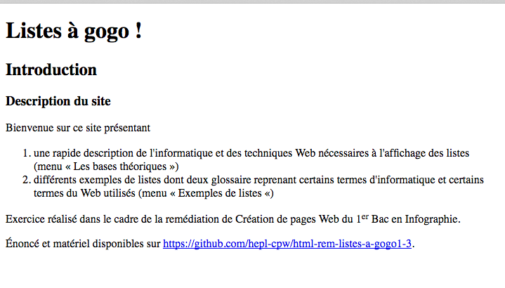
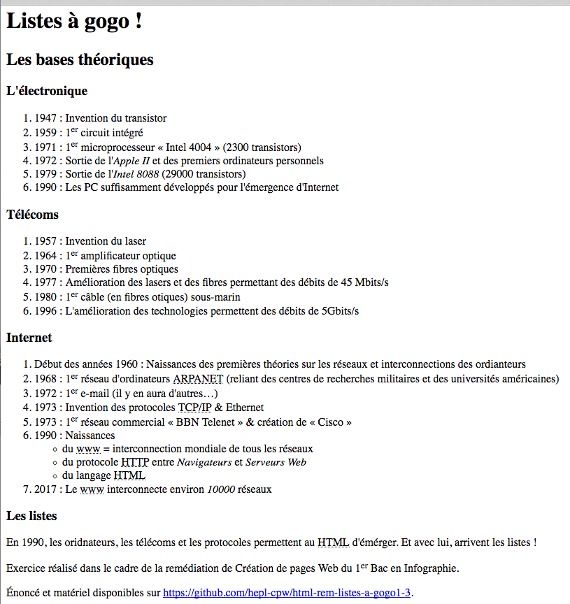
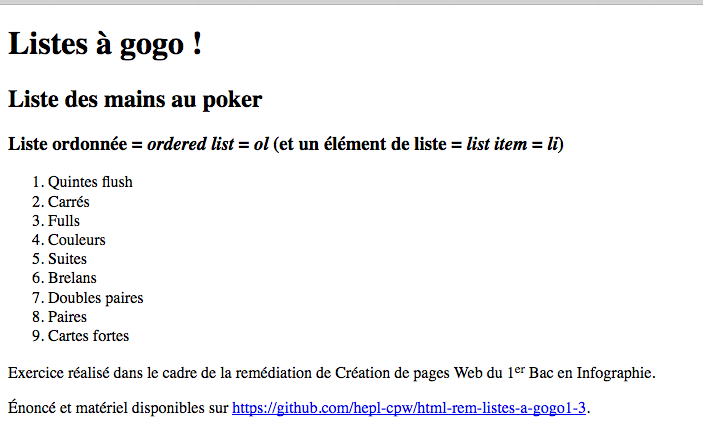
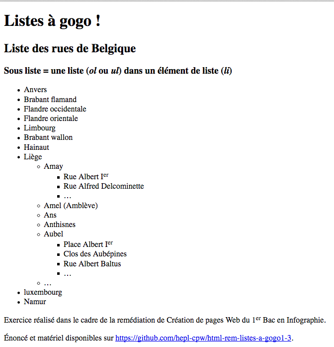
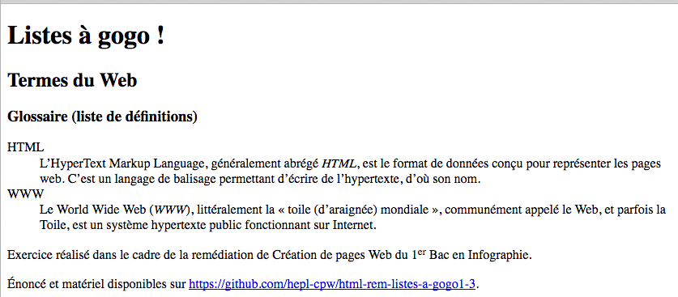
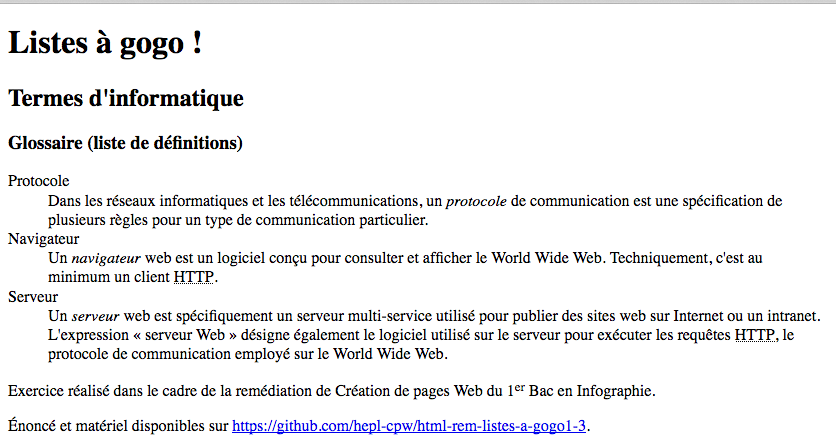

# "Listes à gogo 1/3"

> HTML exercise given at HEPL

* * *

**"Listes à gogo"** is an educational project, which will be used for `HTML` remedial courses.

**Note:** the school where the course is given, the [HEPL](http://www.provincedeliege.be/hauteecole) from Liège, Belgium, is a french-speaking school. From this point, the instruction will be in french. Sorry.

* * *

> Lors de vos cours de *web*, vous allez découvrir les langages HTML et CSS et les mettre en pratique pour apprendre à créer des pages web.  

* * *

## Listes à gogo 1/3

Vous trouverez dans ce dossier un fichier texte HTML nommée **index.html** ansi que six autres fichiers texte HTML dans le dossier **html**. Ce &laquo;&nbsp;mini-site&nbsp;&raquo; &laquo;&nbsp;Liste à gogo&nbsp;&raquo; est dédié aux listes HTML en les re-situant dans leur contexte et en présentant divers exemples.  

Votre but lors de cette partie 1 sur 3 est de baliser ces 7 fichiers HTML qui permettent d’afficher le contenu dans un navigateur web&nbsp;;

Voici les 7 rendus des différentes pages une fois cette première étape finie.

**Note:** Il n'y a pas de CSS pour cette partie 1.

### Rendu de **index.html**



### Rendu de **bases.html**



### Rendu de **li_mains_poker.html**



### Rendu de **li_symptomes.html**


### Rendu de **li_rues.html**



### Rendu de **li_dfn_web.html**



### Rendu de **li_dfn_info.html**




### 1. Création du fichier HTML

Pour vous aider, voici les étapes que vous pouvez suivre&nbsp;:

1. Remplir les fichier HTML en y plaçant les balises de départ qui fournissent un template de base complet, ce qui implique notamment de bien indiquer que le document est en français et aussi&nbsp;:
	- au niveau de l'en-tête de chacun de 7 documents, de bien définir les méta-informations grâce aux balises `meta`, `title`et `link` appropriées pour&nbsp;:
	    * déclarer correctement l’encodage des caractères utilisé (pour ne pas avoir de problème d’affichage des caractères spéciaux et accentués dans le navigateur)&nbsp;;
	    * renseigner que vous êtes l’auteur du document&nbsp;;
	    * prévoir que, si on recherche votre page sur un moteur de recherche comme Google, les mots-clés donnés en ligne 5 du fichier texte fourni soient associés&nbsp;;
	    * prévoir que, si on recherche votre page sur un moteur de recherche comme Google, le moteur de recherche affiche la description donnée en ligne 6 du fichier texte fourni dans la page qui présente les résultats de recherche&nbsp;;
	    * prévoir que, si votre page est affichée dans un ancien navigateur IE qui ne reconnaît pas les nouvelles balises HTML5 (comme `nav`, `section`, etc.), ces dernières puissent malgré tout être correctement affichées par le navigateur en question (voir la section **«&nbsp;Ressources&nbsp;»** ci-dessous) &nbsp;;
	    * faire en sorte que le titre du document donné en ligne 4 du fichier texte fourni qui s’affiche dans l’onglet du navigateur&nbsp;;
	- au niveau du corps de chacun des 7 documents, de découper la page en trois comme ceci&nbsp;:
	 	 * le tritre principal (balise `h1`)&nbsp;;
	 	 * le contenu principal (balise `main`)&nbsp;;
	 	 * 2 paragraphes (balises `p`) pour les 2 dernières phrases&nbsp;;
	 	 * NB : une meilleure découpe sera effectuée lors de la partie 3
	- bien prendre soin d'utiliser les entités suivantes à bon escient&nbsp;:
		 * `&nbsp;`
		 * `&laquo;`
 		 * `&raquo;`
		 * `&hellip;`
		 * `&amp;`

    
2. baliser le texte en utilisant les balises HTML correctes&nbsp;;

3. faire en sorte que le lien fourni en dernière ligne de chacun des 7 document soit cliquable et mène vers l'url en question. N'oubliez pas le(s) attribut(s) utile(s).

### 2. Aides

#### 2. 1. Liste des balises

Une petite aide, voici la liste des balises HTML dont vous aurez besoin pour réaliser cet exercice : `html` (avec l'attribut `lang`), `head`, `meta` (avec les attributs `charset`, `name`, `content`), `script`, `title`, `body`, `h1`, `main`, `h2`, `h3`, `ol`, `ul`, `li`, `dl`, `dt`, `dd`, `p`, `abbr` (avec les attributs `lang` et `title`), `b`, `a` (avec les attributs `href`, `title`), `i` (avec éventuellement attribut `lang`), `time`, `sup` et `em`.

#### 2. 2. Rappel concernant les commentaires en HTML

- les commentaires en HTML s'indiquent entre les symboles `<!--` (marqueur de début de commentaire) et `-->` (marqueur de fin de commentaire). Tout ce qui se trouve entre ces deux marqueurs est ignoré par le navigateur, ce sont des textes qui ne sont ni affichés dans la page, ni interprétés par le navigateur. Ils sont réservés à l’usage exclusif du développeur. Vous pouvez y indiquer tout ce qui vous aide à comprendre, à organiser ou à relire votre code. Voici un exemple :

```html
    <!-- balise meta pour l'encodage des caractères --> 
    <meta charset="utf-8"> <!--  déclare au navigateur que l'encodage des caractères du document courant
                                 est réalisé en UTF-8 --> 
```

- les commentaires conditionnels s’indiquent entre les symboles `<!--[if lt IE …]` (marqueur de début de commentaire conditionnel) et `<![endif]-->` (marqueur de début de commentaire conditionnel). Tout ce qui se trouve entre ces deux marqueurs est ignoré par les navigateurs récents et n’est lu QUE par les navigateurs qui respectent la condition. Par exemple, ce qui se trouve dans le commenaire suivant (entre `<!--[if lt IE 9]>` et `<![endif]-->`) n’est exécuté QUE par les navigateurs IE antérieurs à IE9 : 

```html
<!--[if lt IE 8]>
    <link rel="stylesheet" href="css/screen-ie678.css">
<![endif]-->
```

#### 2. 3. Astuce pour démarrer beaucoup plus vite

Si vous utilisez ST3 et que l’extension Emmet est installée, il existe un raccourci clavier qui vous permet d’obtenir beaucoup plus rapidement un *template* de base qu’il vous suffira de compléter / modifier en fonction de vos besoins.

Presser simplement les touches `!` et `TAB` de votre clavier. Cela vous donnera déjà le résultat suivant : 

```html
<!DOCTYPE html>
<html lang="fr">
    <head>
        <meta charset="utf-8">
        <meta name="description" content="Description">
        <title>Document</title>
    </head>
    <body>
        
    </body>
</html>
```

Il vous suffit de changer la langue du document (de `en` en `fr`), de remplacer le mot-clé « Description » dans l’attribut `content` par votre vraie description et d’ajouter les balises manquantes.


### Ressources

> Ces ressources sont à consulter impérativement, elles font partie de la matière de cours

- [The HTML5 Shiv](https://github.com/afarkas/html5shiv). Aidez-vous de cette ressource pour télécharger les fichiers nécessaires et installer HTML5 Shiv, qui permet aux anciens navigateurs d’utiliser les nouvelles balises HTML5. N.B. Utilisez la procédure d’installation manuelle.

* * *

Bon travail !